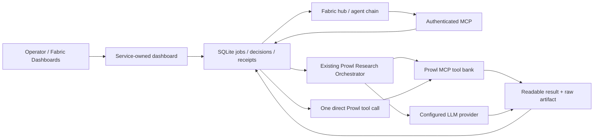

# Prowl Research in Fabric

Entry point for the Fabric adapter. Design: [dashboard specification](design/fabric-dashboard.md). Behavioral truth: [scenarios](ux/scenarios.md). Verification and remaining gates: [handoff](evidence/fabric-dashboard/HANDOFF.md).

## Ownership and architecture

The product's original `orchestrator_agent/` lives in the parent prowl-app repository. This separate repository has its own `research_agent/agent/orchestrator.py`. The service adapter calls that existing core (`service/runtime.py::Runtime.live`); it does not add another research engine. CLI and legacy stdio remain usable but their runs are not automatically imported into the service database.



Fabric owns ordering between agents. Prowl owns one bounded job. The journal keeps caller-declared requester/project/chain/node/parent and W3C trace context; these strings are not an admission receipt. Another agent consumes `job.result.output`, then calls the next agent through Fabric `agent.call`. The new service is `prowl-research.default`, distinct from the unrelated private Research Agent installation.

## Tools and parameters

| MCP tool | Input | Result |
|---|---|---|
| `research.run` | runbook, inputs, idempotencyKey, optional context | durable job handle |
| `research.tools.call` | tool, params, idempotencyKey, optional context | durable job handle |
| `research.tutorial` | idempotencyKey, optional context | synthetic job handle; no provider traffic |
| `research.list_runbooks` | empty object | result envelope containing local runbooks and input definitions |
| `research.artifact.get` | id, name | bounded report.md / ledger.json / checkpoint.json / result.json |
| `fabric.job.get` | id | state, decision link or result envelope |
| `fabric.job.cancel` | id | terminal cancellation; no promise of upstream refund |

Exact schemas: `fabric/schemas/research.*.json`, generated from `service/protocol.py` by `PYTHONPATH=. python scripts/build-fabric-manifest.py`. The schemas are resolved locally by `$id`; their URI identifiers are not a promise of hosted schema publication. Contract revision is pinned in `fabric-contract.lock.json`. The service supports modern per-request MCP metadata and legacy initialization; this does not upgrade the separate legacy stdio server's protocol claim.

Every paid request initially requires the operator's authenticated dashboard session. Agent credentials cannot approve their own requests; `fabric.job.get` with `inputResponses` is refused. The job uses URL elicitation to reach operator authentication. Delegated Fabric form approvals and unattended grants remain a separate gate; do not claim that this adapter already supports them.

```json
{
  "name": "research.tools.call",
  "arguments": {
    "tool": "<actual Prowl tool name>",
    "params": {"domain": "example.org"},
    "idempotencyKey": "market-review-node-3-attempt-1",
    "context": {"requester": "growth-agent", "chain": "market-review", "node": "research", "parent": "discovery"}
  }
}
```

`params` accepts the selected tool's input object. Upstream schema, credentials and authorization still apply. Parameters are not shell commands. Same idempotencyKey and request returns the same job; changed request with the same key is rejected. Keys are local to this service instance, not a claim of upstream exactly-once execution.

## Install and operate

From a clean committed checkout on macOS, with uv and Python 3.11 available:

```sh
python3 scripts/install-fabric-service.py
prowl-research-service doctor --json
```

The installer creates an immutable commit release under `~/.local/share/prowl-research/releases/`, a launchd label `chat.prowl.research`, a loopback listener on 18764, and `prowl-research.default.json` in the Fabric service registry. It preserves an explicitly disabled launchd label and retains the current and previous release. It does not install credentials or alter other Research Agent services. Use the release's `venv/bin/prowl-research-service` if the entry point is not on PATH.

Data: `~/Library/Application Support/prowl-research/` (SQLite and runs). Logs: `~/Library/Logs/prowl-research/`. Host token and agent token are separate owned 0600 files. Back up the data directory with the service stopped; do not commit it. The service takes its exclusive lock before creating tokens or reconciling jobs. Startup marks interrupted paid work for inspection; it never automatically resubmits it.

For foreground development only:

```sh
prowl-research-service serve --root /absolute/private/test-data --port 18765
```

Open through Fabric Dashboards' resolved `open_link`; direct HTTP without host login is intentionally unauthenticated. Fabric host main process exchanges its token for a single-use login code. Browser sessions last eight hours; restarting does not silently approve pending jobs. Decisions expire after one hour and are tied to the exact request/config snapshot.

Provider secrets must be supplied by an Observatory-managed consumer launch, outside Git, dashboard fields and plist values. Required names: PROWL_API_KEY and RESEARCH_LLM_API_KEY (or OPENROUTER_API_KEY). No keys means degraded-but-usable tutorial/inspection, not a healthy paid runtime. Local install intentionally does not copy parent `.env` files or reuse unrelated agent credentials.

New MCP registration belongs to `~/.config/agentgateway/servers.yaml`, with only this service's agent token in the gateway secrets store. Do not put the host token in agent configs. Generate gateway configuration and migrate only the named server; this machine-specific configuration is not committed here. A gateway route is not Fabric hub admission.

## Accounting and intervention

- `Store.calls` is the single source of request and service usage. Tool failures retain actual billed cost; LLM receipts are written before truncated/null completion validation. Unknown price stays null; tutorial receipts never enter the Fabric usage report.
- Per-run actual costs are separate from legacy estimates. The service does not advertise an enforced monetary cap. Runbook budgets cover tools only; models are additional. Maximum 256 paid calls per request, configurable wall-clock timeout 1–60 minutes, workers 1–5, shared concurrent jobs 1–4.
- Configuration changes use revision checks and a visible diff. Existing jobs keep their model/worker/timeout snapshots; the shared scheduler's parallel-job setting is current service policy.
- Cancellation interrupts future work and preserves receipts. A request that lost an upstream reply may have been charged. Inspect first; a new request is a new spending decision.
- Model/ledger classifications are not independent verification. KA-03…KA-12 from the [deep audit](reports/2026-10-10-agent-deep-audit/README.md) remain open unless separately proven fixed. The adapter's durable failure receipts mitigate KA-12 within this service path only.

## Verification commands

```sh
python -m pytest -q
PYTHONPATH=. python scripts/verify-fabric-contract.py /path/to/clean/pinned/fabric-agent-contract
npm ci --ignore-scripts
npx playwright install webkit
npm run test:dashboard
```

The browser check uses a disposable service/data directory and WebKit. It never requires provider keys or calls paid providers. Native host discovery/open, schema checks, local execution and paid-provider acceptance are separate receipts.
