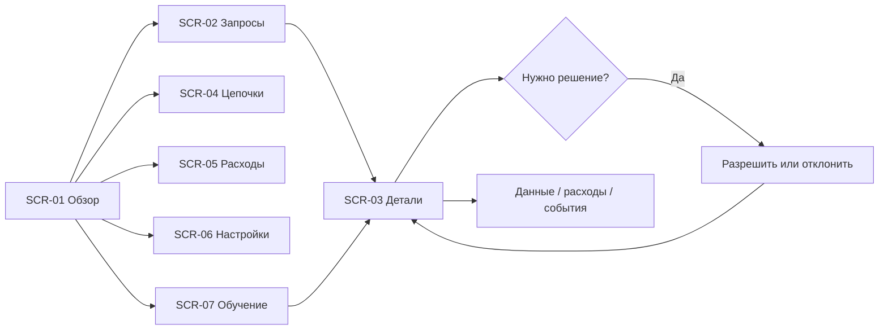

<!-- Managed with super-ux (ux-contract v4). -->
# Prowl Research — flows

### FLW-01: Наблюдение и вмешательство
**Story:** ST-001
**Task analysis:** заметить проблему → выбрать запрос → прочитать вход/историю → решить → проверить следствие.

Ошибки: просроченное решение → сообщение и повторное чтение; offline → сохранить видимый снимок и показать дату; нет ключей → запуск запрещён, обучение доступно; изменение настроек → показать diff и применить только к новым запросам.
